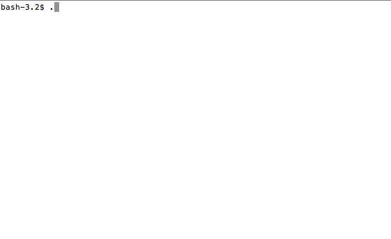

# Bin-Packing
CSCI-338 Bin packing assignment

## Packing

### Goal 

Place a list of rectangles into the smallest area possible, without overlapping. 

### Why
This problem, and its variants are *probably* NP-hard. The NP-Complete variant of *this* problem can be stated as:

"Given a set of rectangles, can they be fit into an area less than or equal to some area **x**?". 

Because the problem we are providing has a lot more structure than some of the other NP-hard problems, it is actually possible that you could exploit the structure to solve this quickly, but I somewhat doubt it. 

The purpose of this assignment is to display the practical concerns with solving difficult and intractable problems. 

### How
Make a strategy using heuristics. 

The simplest solution would be placing each rectangle in a single, long, row. This would be faster than any other solution, but would provide a reasonably awful solution most times. 

Most of us could easily find solutions that are somewhat okay. Try to figure out how *you* are capable of doing this; and make a program to do so.

### You need
[This code](https://github.com/Alex-Huleatt/Bin-Packing). 

### You provide
You will create a Python module with a function named "run" that accepts a single argument consisting of a list of tuples of type (int, int) representing the sizes of *n* rectangles. Your function will return a list of tuples of type (int, int), specifying the positions of the rectangles. See sample_solution.py for an example.

We will run your code with the code provided, you will ensure your program can be successfully called by mine. You can look at the example to see exactly how that works. 

Your code will return a list of positions, as tuples, that represent the positions of the rectangles passed in. The n*th* tuple you return is the position of the n*th* rectangle provided. 

Because of this you **cannot** rotate rectangles.

We will validate your results to ensure that no overlapping occurs, otherwise it is not a valid solution.

You are both encouraged and expected to test your solution with the provided code.
### Grading

We can't grade solely on speed, because that incentivizes terrible solutions.

We can't grade solely on smallest area, because that incentivizes taking till the end of time finding the optimal solution.

Therefore, we must factor both area and time.

* We will run your code on some number of data files.
* Each data file will have a **maximum allowed time**.
* You *pass* a data file if the time taken to generate a solution is less than the max time.

Grading is going to be competitive. We are going to rank everyone based on **the number of passed data files**, tie-broken with **the quality of your solutions**. 

## Using

This will be roughly how I test a solution.
You are welcome to add some code in your solution to automate your own testing process.
I'd recommend that you test your solution in the shown way at least once before turning it in.

##TL;DR

* Give each of *n* rectangles an intenger position, such that they do no overlap.
* Do it fast.
* Use as little space as possible. 
* You want to pass as many data sets as possible, this is the most important thing.
* In the case that someone solves as many as you, whoever has the smaller solutions wins. 

[If your code doesn't work.](https://www.youtube.com/watch?v=M5QGkOGZubQ)

## Links

* https://en.wikipedia.org/wiki/Heuristic
* https://en.wikipedia.org/wiki/Bin_packing_problem

Gifs were made via [ttygif](https://github.com/icholy/ttygif).

